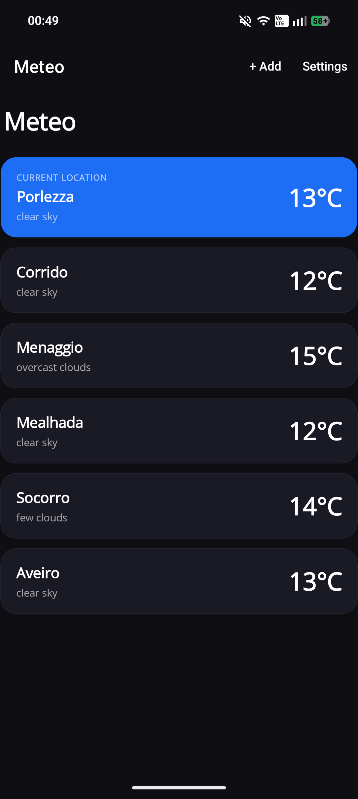
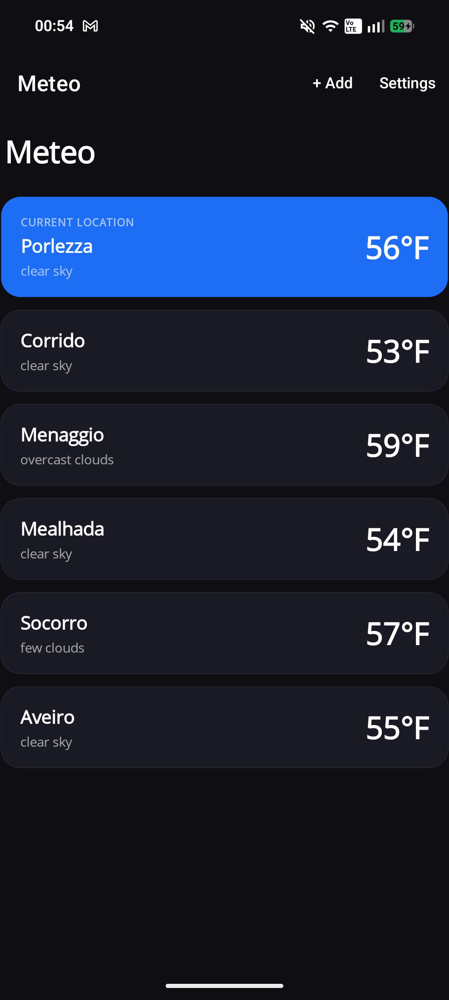
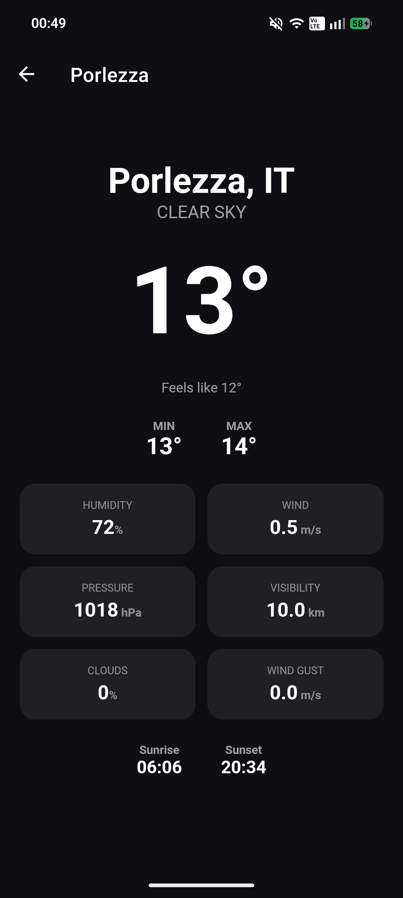
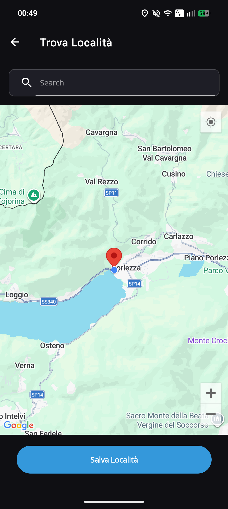
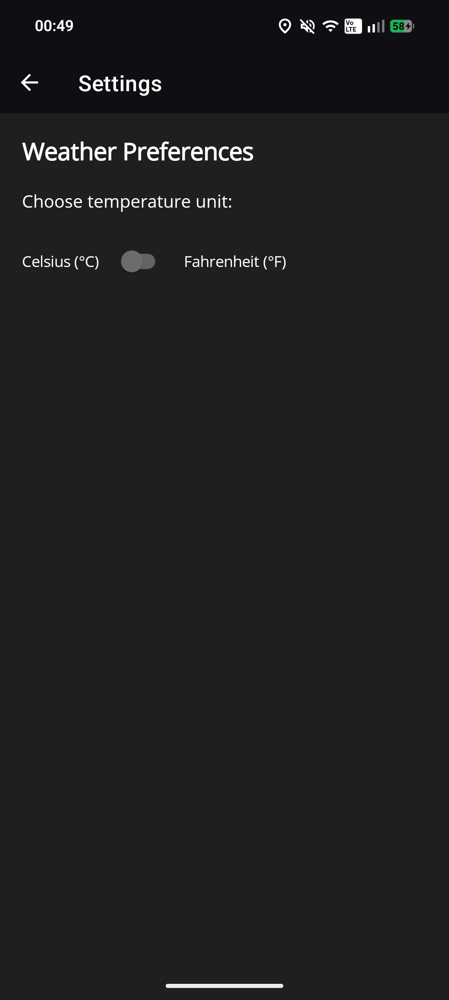

# 🌤️ MeteoApp

A modern weather application built with **.NET MAUI** for Android, featuring real-time weather data, location management, and a clean MVVM architecture.

---

## 📸 Screenshots

| Home (C) | Home (F) |  Details | Search | Settings |
|------|------|---|--------|----------|
|  | |  |  |  |


---

## ✨ Features

- 📍 **Current location weather** — automatically detects and displays weather for your current position
- 🔍 **Location search** — search and save multiple locations worldwide
- 🌡️ **Temperature unit toggle** — switch between Celsius and Fahrenheit
- 🔔 **Weather notifications** — receive alerts and weather updates
- 💾 **Offline support** — cached data available via local SQLite database
- ☁️ **Cloud sync** — locations and preferences synced via Appwrite backend
- 🔄 **Auto-refresh** — weather data is updated on every app launch

---

## 🏗️ Architecture

MeteoApp follows the **MVVM** pattern using the [CommunityToolkit.Mvvm](https://learn.microsoft.com/en-us/dotnet/communitytoolkit/mvvm/) library, with a clean separation between Core logic and platform-specific concerns.

```
MeteoApp/
├── MeteoApp.Core/                        # Platform-agnostic core library
│   ├── Models/
│   │   ├── LocationSuggestion.cs
│   │   └── WeatherLocation.cs
│   ├── Services/
│   │   ├── Interfaces/                   # Service contracts
│   │   ├── AppwriteService.cs
│   │   ├── DatabaseService.cs
│   │   ├── LocationManager.cs
│   │   ├── SearchLocationSuggestionService.cs
│   │   └── WeatherService.cs
│   └── ViewModels/
│       ├── MainViewModel.cs
│       ├── SearchLocationViewModel.cs
│       ├── SettingsViewModel.cs
│       └── WeatherLocationViewModel.cs
│
└── MeteoApp/                             # MAUI Android app
    ├── Components/
    ├── Extensions/
    ├── Platforms/
    ├── Resources/
    ├── Services/
    │   ├── LocationService.cs
    │   ├── NavigationService.cs
    │   ├── NotificationService.cs
    │   ├── PreferencesService.cs
    │   └── WeatherStateService.cs
    ├── Views/
    │   ├── MainPage.xaml
    │   ├── SearchLocationPage.xaml
    │   ├── SettingsPage.xaml
    │   └── WeatherLocationPage.xaml
    ├── App.xaml
    ├── AppShell.xaml
    └── MauiProgram.cs
```

### Key components

| Component | Responsibility |
|---|---|
| `MainViewModel` | Orchestrates location loading, weather refresh, and navigation |
| `IWeatherApiService` | Fetches weather data from OpenWeatherMap |
| `IDatabaseService` | Local persistence via SQLite |
| `ILocationManager` | Manages saved locations (add, update, remove) |
| `ICurrentLocationService` | Retrieves the device's GPS coordinates |
| `ISearchLocationSuggestionService` | Uses Google Maps Geocoding to read human locations and translates them to coordinates |
| `ISettingsService` | Reads and writes user preferences |
| `INavigationService` | Abstracts MAUI Shell navigation |

---

## 🛠️ Tech Stack

| Layer | Technology |
|---|---|
| Framework | .NET MAUI |
| Language | C# 14 |
| MVVM | CommunityToolkit.Mvvm |
| Weather data | [OpenWeatherMap API](https://openweathermap.org/api) |
| Cloud backend | [Appwrite](https://appwrite.io/) |
| Local database | SQLite |
| Target platform | Android |

---

## 🚀 Getting Started

### Prerequisites

- [.NET 10 SDK](https://dotnet.microsoft.com/download)
- [Visual Studio 2026](https://visualstudio.microsoft.com/) with the MAUI workload installed
- An [OpenWeatherMap API key](https://home.openweathermap.org/api_keys)
- A Google Maps Geocoding API key
- An [Appwrite](https://appwrite.io/) project with a database and collection configured